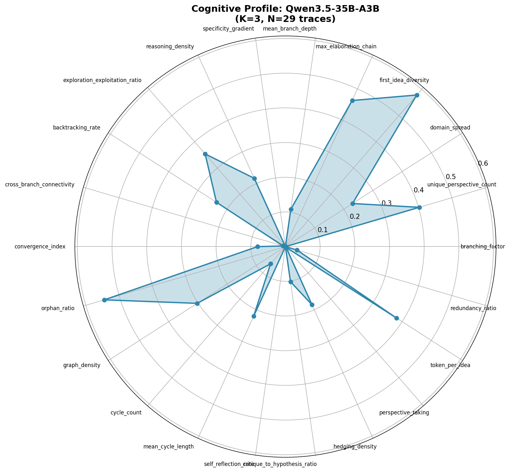

# ThinkBench Benchmark Report

**Generated:** 2026-04-16 08:17
**Model:** Qwen/Qwen3.5-35B-A3B
**Configuration:** K=3 runs per question, 10 ethical dilemma questions
**Extraction:** v2 (non-generative: regex + TextTiling + DeBERTa NLI)

---

## Summary Statistics

| Metric | Value |
|--------|-------|
| Total Traces | 29 |
| Avg Tokens/Trace | 1525.1 |
| Avg TUs/Trace | — |

---

## Cognitive Metrics (22 metrics across 5 categories)

### Breadth (4 metrics)
| Metric | Value |
|--------|-------|
| branching_factor | 0.0000 |
| unique_perspective_count | 4.62 |
| domain_spread | 3.07 |
| first_idea_diversity | 0.5784 |

### Depth (4 metrics)
| Metric | Value |
|--------|-------|
| max_elaboration_chain | 7.48 |
| mean_branch_depth | 1.98 |
| specificity_gradient | 0.0000 |
| reasoning_density | 0.2166 |

### Structure (6 metrics)
| Metric | Value |
|--------|-------|
| exploration_exploitation_ratio | 3.5358 |
| backtracking_rate | 0.2364 |
| cross_branch_connectivity | 0.0070 |
| convergence_index | 0.0805 |
| graph_density | 0.3025 |
| revision_depth | — |

### Metacognitive (4 metrics)
| Metric | Value |
|--------|-------|
| self_reflection_rate | 0.0000 |
| critique_to_hypothesis_ratio | 0.1021 |
| hedging_density | 0.1841 |
| perspective_taking | 0.003135 |

### Efficiency (2 metrics)
| Metric | Value |
|--------|-------|
| token_per_idea | 442.20 |
| redundancy_ratio | 0.034483 |

---

## Key Observations

1. **Reasoning Depth**: Mean branch depth of 1.98 indicates shallow reasoning chains
2. **Exploration vs Exploitation**: Ratio of 3.54 shows strong exploration approach
3. **Backtracking**: 23.6% backtracking rate indicates moderate self-correction
4. **Hedging**: 18.4% hedging density suggests high uncertainty expression
5. **Connectivity**: Graph density of 0.30 reflects moderate semantic connectivity

---

## Visualization

---

## Methodology

- **Data Collection**: vLLM endpoint at 10.17.1.57:8978, model Qwen/Qwen3.5-35B-A3B
- **Extraction (v2)**: Non-generative 3-pass pipeline — regex cue phrases (Pass 1), TextTiling with all-MiniLM-L6-v2 (Pass 2), DeBERTa NLI edge promotion (Pass 3)
- **Metrics**: 22 cognitive metrics across 5 categories (breadth, depth, structure, metacognitive, efficiency)
- **System Prompt**: "Think through this problem carefully and thoroughly..."

---
*Generated by ThinkBench Benchmark v2*
