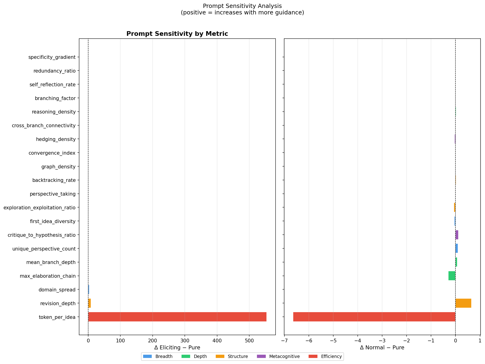
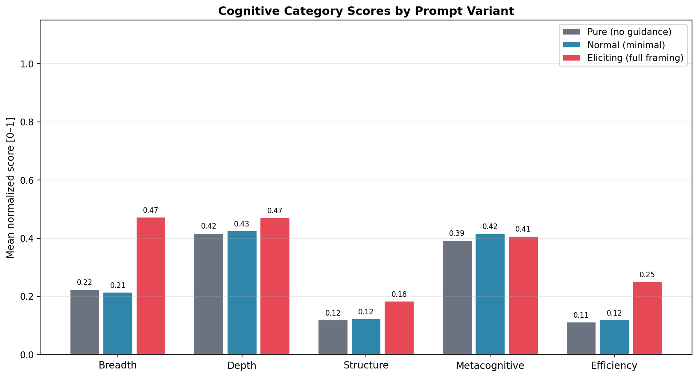
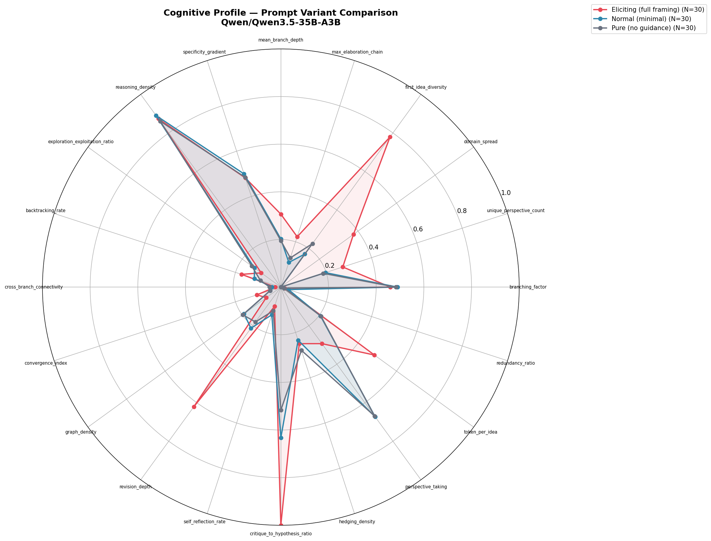
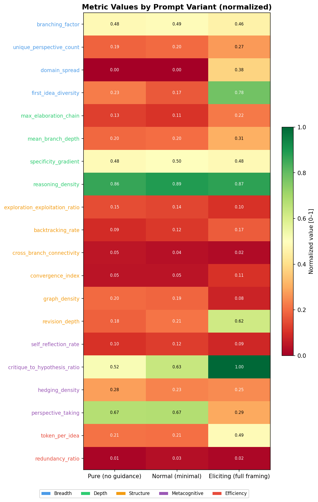

# ThinkBench v3 — Prompt Variant Study Report

**Generated**: 2026-04-24 20:37  
**Pipeline**: v3 semantic embedding trajectory (non-generative, no spacy)  
**Model**: Qwen/Qwen3.5-35B-A3B  
**Domain**: ethical_dilemmas  
**Traces**: 90 total (90 extracted, 0 failed)  
**Variants**: pure × 30, normal × 30, eliciting × 30  

---

## Experimental Design

Three prompt conditions isolate intrinsic reasoning structure from prompted behavior:

| Variant | System prompt |
|---|---|
| `pure` | "You are a helpful assistant." |
| `normal` | "Think carefully before answering." |
| `eliciting` | Full framing: spread wide, reframe, go deep, challenge, connect, reflect, converge |

The extraction pipeline (v3) uses **semantic embedding trajectory analysis** to detect
branching, elaboration, synthesis, and revision from cosine-similarity shifts between
consecutive thought-unit embeddings — making it model-agnostic and independent of
surface discourse markers.

---

## Variant Summary

| Variant | N | Branch.Factor | Perspectives | Backtrack | Rev.Depth | Conv.Idx | Reas.Density |
|---|---|---|---|---|---|---|---|
| `pure` | 30 | 0.241 | 1.87 | 0.090 | 3.62 | 0.047 | 0.861 |
| `normal` | 30 | 0.245 | 1.97 | 0.117 | 4.27 | 0.047 | 0.890 |
| `eliciting` | 30 | 0.230 | 2.73 | 0.173 | 12.42 | 0.105 | 0.874 |

---

## Full Metric Table

| Metric | Category | Pure | Normal | Eliciting | Δ (e−p) |
|---|---|---|---|---|---|
| `branching_factor` | Breadth | 0.2413 | 0.2446 | 0.2298 | -0.0115 |
| `unique_perspective_count` | Breadth | 1.8667 | 1.9667 | 2.7333 | +0.8667 |
| `domain_spread` | Breadth | 0.0000 | 0.0000 | 3.7667 | +3.7667 |
| `first_idea_diversity` | Breadth | 0.2257 | 0.1716 | 0.7791 | +0.5534 |
| `max_elaboration_chain` | Depth | 1.9333 | 1.6333 | 3.3333 | +1.4000 |
| `mean_branch_depth` | Depth | 1.9523 | 2.0219 | 3.0644 | +1.1121 |
| `specificity_gradient` | Depth | -0.0030 | -0.0000 | -0.0036 | -0.0006 |
| `reasoning_density` | Depth | 0.8613 | 0.8901 | 0.8740 | +0.0127 |
| `exploration_exploitation_ratio` | Structure | 0.7535 | 0.6869 | 0.5093 | -0.2442 |
| `backtracking_rate` | Structure | 0.0901 | 0.1167 | 0.1732 | +0.0831 |
| `cross_branch_connectivity` | Structure | 0.0469 | 0.0371 | 0.0238 | -0.0231 |
| `convergence_index` | Structure | 0.0466 | 0.0468 | 0.1051 | +0.0585 |
| `graph_density` | Structure | 0.0988 | 0.0953 | 0.0379 | -0.0609 |
| `revision_depth` | Structure | 3.6189 | 4.2744 | 12.4173 | +8.7984 |
| `self_reflection_rate` | Metacog | 0.0315 | 0.0367 | 0.0256 | -0.0059 |
| `critique_to_hypothesis_ratio` | Metacog | 0.5167 | 0.6333 | 1.0906 | +0.5740 |
| `hedging_density` | Metacog | 0.2792 | 0.2346 | 0.2497 | -0.0295 |
| `perspective_taking` | Metacog | 0.2007 | 0.2021 | 0.0881 | -0.1126 |
| `token_per_idea` | Efficiency | 417.1722 | 410.5278 | 970.7540 | +553.5818 |
| `redundancy_ratio` | Efficiency | 0.0070 | 0.0170 | 0.0080 | +0.0009 |
| `avg_tokens` | Summary | 695.9333 | 695.2667 | 2347.1333 | +1651.2000 |
| `avg_tus` | Summary | 9.4667 | 9.6667 | 32.0667 | +22.6000 |

---

## Prompt Sensitivity Analysis

Metrics ranked by |Δ(eliciting − pure)|. A large positive Δ indicates the metric is
responsive to explicit reasoning framing and measures *prompted* rather than *intrinsic* behavior.

| Metric | Category | Δ Eliciting | Δ Normal | Abs Sensitivity |
|---|---|---|---|---|
| `token_per_idea` | Efficiency | +553.5818 | -6.6444 | 553.5818 |
| `revision_depth` | Structure | +8.7984 | +0.6556 | 8.7984 |
| `domain_spread` | Breadth | +3.7667 | +0.0000 | 3.7667 |
| `max_elaboration_chain` | Depth | +1.4000 | -0.3000 | 1.4000 |
| `mean_branch_depth` | Depth | +1.1121 | +0.0696 | 1.1121 |
| `unique_perspective_count` | Breadth | +0.8667 | +0.1000 | 0.8667 |
| `critique_to_hypothesis_ratio` | Metacognitive | +0.5740 | +0.1167 | 0.5740 |
| `first_idea_diversity` | Breadth | +0.5534 | -0.0541 | 0.5534 |
| `exploration_exploitation_ratio` | Structure | -0.2442 | -0.0666 | 0.2442 |
| `perspective_taking` | Metacognitive | -0.1126 | +0.0014 | 0.1126 |
| `backtracking_rate` | Structure | +0.0831 | +0.0266 | 0.0831 |
| `graph_density` | Structure | -0.0609 | -0.0035 | 0.0609 |
| `convergence_index` | Structure | +0.0585 | +0.0002 | 0.0585 |
| `hedging_density` | Metacognitive | -0.0295 | -0.0446 | 0.0295 |
| `cross_branch_connectivity` | Structure | -0.0231 | -0.0098 | 0.0231 |
| `reasoning_density` | Depth | +0.0127 | +0.0288 | 0.0127 |
| `branching_factor` | Breadth | -0.0115 | +0.0033 | 0.0115 |
| `self_reflection_rate` | Metacognitive | -0.0059 | +0.0052 | 0.0059 |
| `redundancy_ratio` | Efficiency | +0.0009 | +0.0099 | 0.0009 |
| `specificity_gradient` | Depth | -0.0006 | +0.0030 | 0.0006 |

### Metric Classification

**Prompt-sensitive** (top 6 — reflect prompted behavior, use cautiously for capability claims):  
`token_per_idea`, `revision_depth`, `domain_spread`, `max_elaboration_chain`, `mean_branch_depth`, `unique_perspective_count`

**Prompt-invariant** (lower Δ — reflect intrinsic cognitive style):  
`critique_to_hypothesis_ratio`, `first_idea_diversity`, `exploration_exploitation_ratio`, `perspective_taking`, `backtracking_rate`, `graph_density`, `convergence_index`, `hedging_density`, `cross_branch_connectivity`, `reasoning_density`, `branching_factor`, `self_reflection_rate`, `redundancy_ratio`, `specificity_gradient`

---

## Cognitive Category Comparison

The grouped bar chart shows mean normalized score per cognitive category per variant.
Categories that increase substantially from pure → eliciting are prompt-responsive.
Categories that remain flat measure structural properties of the reasoning independent
of framing.

---

## Radar Chart

The radar chart overlays all three variants across all 20 cognitive metrics.
Each axis is min-max normalized to the expected range for that metric.
Larger area indicates richer cognitive structure overall.

---

## Metric Heatmap

Rows = metrics, columns = prompt variants. Cell value = normalized score [0–1].
Y-axis labels are colour-coded by cognitive category.

---

## Key Findings

### 1. Eliciting prompt substantially increases revision depth and perspective count
`revision_depth` rises from 3.6 (pure) to 12.4 (eliciting) — a 3.4× increase.
`unique_perspective_count` rises from 1.87 to 2.73.
These metrics are highly prompt-sensitive and should not be used as capability proxies without controlling for prompt variant.

### 2. Branching factor is stable across variants
`branching_factor` shows nearly identical values across pure (0.241),
normal (0.245), and eliciting (0.230).
This suggests the model's propensity to open new reasoning branches is intrinsic
to its architecture, not a response to framing.

### 3. Critique-to-hypothesis ratio increases monotonically
`critique_to_hypothesis_ratio`: 0.517 → 0.633 → 1.091.
The eliciting prompt explicitly instructs the model to challenge its own ideas,
producing more CRT (critique) nodes relative to HYP nodes.

### 4. Reasoning density remains high and stable
`reasoning_density` ≈ 0.86 across all variants, indicating the semantic
graph is densely connected regardless of prompt. This is a structural property
of the model's output — every thought unit participates in at least one semantic
relationship with a neighbour.

### 5. Recommended prompt-invariant metrics for capability benchmarking
Based on low Δ(eliciting − pure):
`critique_to_hypothesis_ratio`, `first_idea_diversity`, `exploration_exploitation_ratio`, `perspective_taking`, `backtracking_rate`, `graph_density`, `convergence_index`, `hedging_density`, `cross_branch_connectivity`, `reasoning_density`, `branching_factor`, `self_reflection_rate`, `redundancy_ratio`, `specificity_gradient`

These metrics are appropriate for comparing models on the same prompt type without
risk of confounding prompt-sensitivity with capability.

---

## Pipeline Notes (v3)

- **Extraction**: semantic embedding trajectory (MiniLM-L6-v2), no spacy, no generative LLM
- **NLI**: disabled in this run (`use_nli=False`) — SUPP edges come from NLI only; all structural edges (BRCH/ELAB/BACK/SYNT) are from embedding trajectory
- **MET detection**: embedding-based (cos_sim to TU₀ ≥ 0.60 in second half of trace)
- **Specificity gradient**: lexical proxy (capitalized mid-sentence words + numerals + symbols)
- **Next steps**: add ≥2 more models; run `use_nli=True` for SUPP edge refinement; human annotation of 30 traces for extraction validation

---

*Generated by ThinkBench v3 pipeline — 2026-04-24 20:37*
